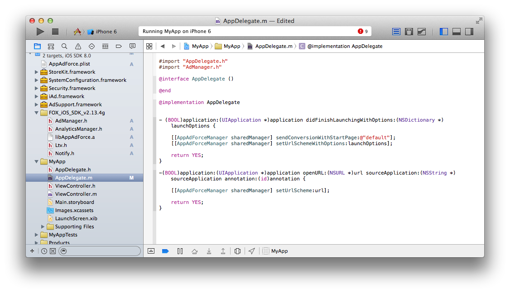

## sendConversionWithStartPage:的詳細

利用`sendConversionWithStartPage:`方法能夠進行Install計測。在使用Cookie計測手法的場合，外部瀏覽器被啟動。這個時候，可以把外部瀏覽器的遷移目的地用字符串形式指定到`sendConversionWithStartPage:`的參數裡。

編輯項目的源代碼，請按下面那样来安装到Application Delegate的`application:didFinishLaunchingWithOptions:`里。

> 【注意事项】
沒有特別的理由請將`sendConversionWithStartPage:`安裝在`application:didFinishLaunchingWithOptions:`裡面。安裝在別的地點的場合可能無法正確計測安裝數值。
在沒有安裝`application:didFinishLaunchingWithOptions:`的狀態下投放安裝成果型廣告的時候，請一定通知廣告代理店或者媒體負責人。在不能正常計測的狀態下投放安裝成果型廣告的時候，有可能被要求支付超過計測安裝數的廣告費用。

```objective-c
#import "AdManager.h"

// - (BOOL)application:(UIApplication *)application
//   didFinishLaunchingWithOptions:(NSDictionary *)launchOptions {

[[AppAdForceManager sharedManager] sendConversionWithStartPage:@"default"];
[[AppAdForceManager sharedManager] setUrlSchemeWithOptions:launchOptions];

// }
```

通常請在sendConversionWithStartPage:的參數裡像上面那樣輸入@"default"。默認是顯示準備好的標準頁面，可以在FOX管理畫面裡任意設定遷移頁面的URL。



想要遷移至特定URL的場合，或者用APP動態生成URL的場合，請設定URL字符串。

```objective-c
[[AppAdForceManager sharedManager] sendConversionWithStartPage:@"http://yourhost.com/yourpage.html"];
```
代替`sendConversionWithStartPage:`使用`sendConversionWithStartPage:buid:`方法、能夠輸出廣告主終端設備ID到成果LOG裡。比如，在APP起動時生成的UUID和初次啟動的成果綁定到一起做管理的場合可以利用這個方法。

```objective-c
[[AppAdForceManager sharedManager] sendConversionWithStartPage:@"http://yourhost.com/yourpage.html" buid:@"{your uniq id}"];
```
> `sendConversionWithStartPage:buid:`作為剛啟動後的處理有必要實際安裝，像登錄ID這樣的用戶行動相伴的值無法通過參數傳遞。

## Fingerprint計測時的注意事項

Fingerprint計測使用WebView，獨自定制化的UserAgent將無法正常計測。
把WebView的UserAgent定制化成獨自的字符串以前請一定安裝下面的方法。

```objective-c
[[AppAdForceManager sharedManager] cacheDefaultUserAgent];
```

## 3.2.	v2.16g以前的舊版本的場合

到現在，進行reengagement計測的時候，需要在`didFinishLaunchingWithOptions:`裡安裝`setUrlSchemeWithOptions:`方法。由於已經統合到`setUrlScheme:`方法裡了，從本文檔開始刪除了需要安裝的記載。

[削除]
```objective-c
  [[AppAdForceManager sharedManager] setUrlSchemeWithOptions:launchOptions];
```

此外，為了保持向下兼容性，可以按過去的那種方式來調用。


---
[TOP](/lang/ja/README.md)
